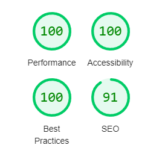
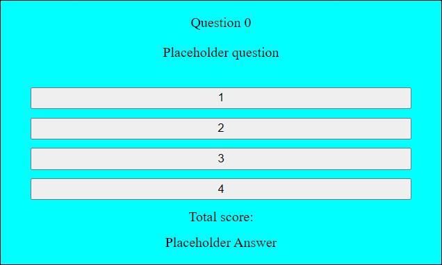

# Quizels World Quiz
Quizels is a website with a quiz that asks questions about big things in the world.
## Responsive design
The website has been tested and built to be responsive for multiple screen sizes. The page was testing using Lighthouse with an accessibility score of 100.

## Features

### Header
The header has big text and contrasting color to stand out and easy to read. The header is always on top and will automatically fill its place to fit any screen size.
The text has a drop shadow, so that it doesn't blend with the background.

### Quiz Section
The quiz body consists of three parts: the Question, the answer, the score.
The quiz body have one unified background color contained in a single border.
Making it clear that the three parts are related.
The content are centered and the buttons have a padding that it doesn't fill the entire width.

## Issues

### Bugs (Resolved)
- The score falsely adds a point on the second answer of the second question.
- It also adds a point falsely on the second option of question three.
- There's a false addition of two points on option 1.
    * These instances were fixed by only adding the event listener to the buttons once.

### Console errors
Console errors would appear when clicking buttons at the end of the quiz. This was resolved by removing the event listeners for the buttons.

During implementation of the retake quiz button at the end, there would appear console errors when clicking the retake quiz button.
This was resolved by adding the event listener to the button at the correct place, previously it was placed in a function that activated when the button was pressed.

## Credit
Made use of [W3Schools](https://www.w3schools.com/js/) and their JavaScript tutorials for inspiration and code snippets.  
A few tutorials used where:
- [JavaScript Functions](https://www.w3schools.com/js/js_functions.asp)
- [JavaScript Arrays](https://www.w3schools.com/js/js_arrays.asp)
- [JavaScript For Loop](https://www.w3schools.com/js/js_loop_for.asp)

The favicon image uses the [dummyimage](https://dummyimage.com) website to create a simple image.